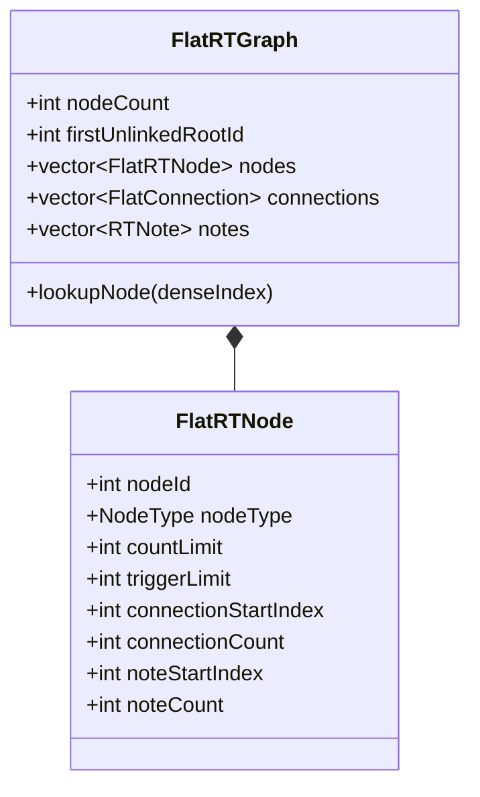

# SequenceTree: Comprehensive Architectural Audit & Engineering Manifesto

> An exhaustive, deep-dive evaluation of SequenceTree's software architecture, real-time safety invariants, data-oriented design possibilities, domain modeling, compiler engineering, UI reactivity, and development constraints.

---

## Executive Summary

SequenceTree is a conceptually rich, highly original algorithmic MIDI sequencer and graph-traversal instrument built on the JUCE framework in C++20. Users compose directed generative graphs where node visit counters, trigger limits, conditional probabilities, sub-loops, cross-tree jumps, and custom-scripted child selection strategies produce complex polyphonic structures.

While the core traversal mechanics and the Read-Copy-Update (RCU) snapshot publishing model demonstrate impressive engineering, the codebase suffers from severe architectural coupling, hidden concurrency hazards, cache-unfriendly pointer graphs on the real-time audio thread, $O(K \times N)$ scheduling bottlenecks, and developmental friction caused by unconventional project constraints.

This document presents a deep-dive analysis across seven fundamental engineering dimensions, detailing root causes, design pattern alternatives, software principles (SOLID, Clean Architecture, Data-Oriented Design), and a step-by-step modernization roadmap.

---

## Table of Contents

1. [Architectural Overview & The Inversion of Authority](#1-architectural-overview--the-inversion-of-authority)
2. [Real-Time Audio Engine & Concurrency Engineering](#2-real-time-audio-engine--concurrency-engineering)
3. [Algorithmic Complexity & Discrete Event Scheduling](#3-algorithmic-complexity--discrete-event-scheduling)
4. [Data-Oriented Design & Cache Locality (DOD vs OOP)](#4-data-oriented-design--cache-locality-dod-vs-oop)
5. [Embedded Scripting Language, Compiler & Bytecode VM](#5-embedded-scripting-language-compiler--bytecode-vm)
6. [UI Architecture, Rendering Pipelines & State Binding](#6-ui-architecture-rendering-pipelines--state-binding)
7. [DAW Integration, Automation & JUCE Idioms](#7-daw-integration-automation--juce-idioms)
8. [Critical Critique of Repository Meta-Rules (CLAUDE.md)](#8-critical-critique-of-repository-meta-rules-claudemd)
9. [Comprehensive Architectural Modernization Blueprint](#9-comprehensive-architectural-modernization-blueprint)

---

## 1. Architectural Overview & The Inversion of Authority

```mermaid
graph TD
    subgraph Anti-Pattern: Current Inverted Architecture
        UI[NodeCanvas / ArrowManager / NodeManager] -->|Compiles & Updates| RGB[RTGraphBuilder]
        RGB -->|Publishes Snapshots| ASP[AudioSnapshotPublisher]
        ASP -->|Acquires Snapshot| AE[Audio Engine / ProcessBlock]
        GS[GraphState: Model] <---|Mutates| UI
        PWin[Window Close Event] -.->|Unhooks Listeners| UI
        Note1[Audio Engine Stalls or Plays Stale Data Headless]
    end

    subgraph Target: Clean Architecture / Unidirectional Data Flow
        Cmd[UI Gestures / Host Automation / Scripts] -->|Dispatches Commands| Model[GraphState: Domain Model]
        Model -->|Domain Event Stream| Sync[GraphEngineSynchronizer: Service]
        Sync -->|Compiles RT Graphs| FlatGraph[Flat Immutable RTGraph]
        FlatGraph -->|Publishes RCU| AE2[Audio Engine / ProcessBlock]
        Model -->|Observes State| View[NodeCanvas: Pure View]
    end
```



### The Inverted Coupling: The View Drives the Domain

In clean software architecture (Clean Architecture, Hexagonal / Ports-and-Adapters, and MVC/MVP):
- The **Domain Model** holds the authoritative truth and business invariants.
- The **Audio Engine** runs deterministically from the domain state, whether a graphical window is open or not.
- The **View** is an ephemeral observer that reflects model state and translates user intent into commands.

In SequenceTree, this dependency arrow is inverted:
- In `Source/UI/Canvas/NodeCanvas.cpp` (lines 174–188), `Source/UI/Canvas/NodeManager.cpp` (line 121), and `Source/UI/Canvas/ArrowManager.cpp` (lines 327, 339), visual canvas components directly invoke `rtGraphBuilder->makeRTGraph(...)` and `rtGraphBuilder->updateDurationMaps(...)`.
- The compilation of the real-time audio graph is an accidental side-effect of UI canvas layout updates.
- In `Source/Plugin/PluginEditor.cpp` (lines 82–93), closing the GUI window calls `detachStateListeners()`, unhooking `NodeCanvasTreeListener`.

#### Consequences of the Current Design:
1. **Broken Headless Execution**: In professional DAWs, plugins often run headlessly during offline rendering ("bounce to disk"), freezing tracks, automated stem export, or batch rendering. If host automation or undo modifies the graph while the window is closed, the audio engine continues playing stale snapshot data.
2. **Scattered Compilation Responsibilities**: Graph compilation is triggered from five disparate UI locations with no unified debouncing, batching, or single source of truth.
3. **Fragile Testing**: It is impossible to test audio graph generation without instantiating the entire JUCE Component and LookAndFeel hierarchy.

#### Design Pattern Remedy: Domain-Driven Reactive Synchronization
Introduce a headless `GraphEngineSynchronizer` owned by `SequenceTreeAudioProcessor`:
- `GraphState` exposes a thread-confined `Observable` or `juce::ValueTree::Listener`.
- `GraphEngineSynchronizer` listens to `GraphState` directly at the processor level, completely independent of `PluginEditor`.
- Any mutation (whether from UI mouse drag, script execution, host automation, or preset loading) flows:
  $$\text{User / Host Action} \longrightarrow \text{GraphState Mutation} \longrightarrow \text{Domain Listener} \longrightarrow \text{RTGraphBuilder} \longrightarrow \text{Snapshot Publisher}$$
- `NodeCanvas` is relegated to its proper role: a pure, passive View.

---

### The Service Locator Anti-Pattern: `ApplicationContext`

`ApplicationContext` (`Source/Util/ApplicationContext.h`) is an 8-pointer bundle of raw non-owning references:
```cpp
struct ApplicationContext
{
    SequenceTreeAudioProcessor* processor          = nullptr;
    NodeCanvas*                 canvas             = nullptr;
    CustomLookAndFeel*          lookAndFeel        = nullptr;
    juce::UndoManager*          undoManager        = nullptr;
    GraphState*                 graphState         = nullptr;
    TraversalRuleState*         traversalRuleState = nullptr;
    NodeController*             nodeController     = nullptr;
    RTGraphBuilder*             rtGraphBuilder     = nullptr;
};
```

This struct is passed by `const ApplicationContext&` into almost every class in the application (`NodeCanvas`, `NodeManager`, `ArrowManager`, `Titlebar`, `BottomBar`, `MenuBar`, `SelectionOps`, `ConnectionOps`, `AudioCommandDrainer`, etc.).

#### Architectural Deficiencies:
1. **Temporal Coupling and Partial Initialization**: In `Source/Plugin/PluginEditor.cpp` (lines 16–33), `ApplicationContext` is populated piecemeal. `canvas` cannot access `context.canvas` in its constructor; `nodeController` cannot access `context.nodeController`. A developer calling a context field during construction risks dereferencing a `nullptr`.
2. **Violation of Interface Segregation Principle (ISP)**: A simple UI component like `ArrowBindBar` receives pointers to the audio processor, the undo manager, the graph builder, and the canvas hit tester, obscuring what the component actually needs.
3. **Hidden Dependencies & Inability to Mock**: Tests cannot isolate `SelectionOps` without constructing a dummy `ApplicationContext` with 8 pointers pointing to partially constructed objects.

#### Design Pattern Remedy: Scoped Dependency Injection & Delegate Interfaces
- Decompose `ApplicationContext` into explicit constructor arguments or fine-grained interfaces.
- For canvas operations: pass `GraphState&` and `juce::UndoManager*`.
- For bars and buttons: pass lambda callbacks (`std::function<void()>`) or explicit command delegates rather than passing the audio engine and graph state.

---

## 2. Real-Time Audio Engine & Concurrency Engineering

Audio callback threads execute under **hard real-time deadlines**. At 96 kHz with a 64-sample buffer, the audio thread has approximately **0.66 milliseconds** to generate all MIDI events. Missing this deadline causes audible clicks, pops, and host dropouts (xruns).

Real-time audio safety strictly forbids:
- Dynamic heap memory allocation (`malloc`, `free`, `new`, `delete`, vector resizing).
- Locking non-try mutexes, blocking synchronization primitives, or sleep.
- Throwing or catching C++ exceptions (`throw`, `std::out_of_range`).
- File or socket I/O, IPC, or message thread dispatch.

SequenceTree handles RCU snapshot swapping cleanly, but contains critical real-time safety violations:

---

### Critical Bug: Exception Throwing via `.at()` on the Audio Thread

#### Locations:
1. `Source/Audio/TraversalLogic.cpp:512`:
   ```cpp
   const RTNode& TraversalLogic::getTargetNode(const NodeMap& nodes) const { return *nodes.at(primary.target); }
   ```
2. `Source/Audio/TraversalSession.cpp:317`:
   ```cpp
   const RTNode& rootNode = *context.nodes.at(rootId);
   ```

#### The Hazard:
`std::unordered_map::at()` is specified by the C++ standard to throw `std::out_of_range` when the key is not found.
- If a node is deleted during playback while a running traversal's target points to it, `.at()` throws.
- The real-time audio thread does not (and must not) have an enclosing `try/catch` block.
- In DAW hosts like Ableton Live, Logic Pro, or Reaper, an unhandled exception escaping `processBlock` invokes `std::terminate()`, **crashing the entire DAW process instantly and destroying unsaved user work**.

#### Remedy:
Replace all `.at()` calls with `.find()`:
```cpp
const auto it = nodes.find(primary.target);
if (it == nodes.end()) {
    return nullptr; // or transition to dead-end state safely
}
return it->second.get();
```

---

### Critical Bug: Audio Thread Heap Allocation in `linkedRootScratch`

#### Location:
`Source/Audio/TraversalSession.cpp:272–289`:
```cpp
int TraversalSession::findFirstUnlinkedRootId(const NodeMap& nodes)
{
    linkedRootScratch.clear();
    for (const auto& [nodeId, node] : nodes) {
        for (const RTConnection& connection : node->connections) {
            const int childId = connection.childId;
            const auto childIt = nodes.find(childId);
            if (childIt != nodes.end() && isRootNode(*childIt->second)) {
                linkedRootScratch.push_back(childId); // <-- HEAP ALLOCATION HAZARD
            }
        }
    }
    std::sort(linkedRootScratch.begin(), linkedRootScratch.end()); // <-- O(N log N) on audio thread
    ...
```

#### The Hazard:
In `Source/Audio/TraversalSession.cpp:24`, `linkedRootScratch` is reserved to `scratchCapacity = 256`.
- If a project graph has more than 256 connections targeting root nodes, `push_back()` triggers an unreserved capacity reallocation (`realloc` / `malloc`) on the audio thread.
- Furthermore, executing `std::sort()` across connections on every block where traversals start wastes precious CPU cycles inside `processBlock`.

#### Remedy:
The identity of the "first unlinked root ID" is a static property of the graph topology. It must be computed **once on the message thread** in `RTGraphBuilder` when constructing the `RTGraph`, and cached as `int firstUnlinkedRootId` in the snapshot. The audio thread should only read this precomputed integer ($O(1)$).

---

### Critical Bug: The Lookahead Leaky Abstraction (`peekNextTarget`)

#### Location:
`Source/Audio/TraversalLogic.cpp:385–418`, called from `Source/Audio/TraversalDispatcher.cpp:209`:
```cpp
const RTNode* nextTarget = traversalLogic.peekNextTarget(nodes);
```

#### The Mechanism:
Because SequenceTree calculates note duration from arrow geometry (`arrowDurationFromDelta`), the dispatcher needs to know which node will be visited next *before* the current note begins playing. To do this, it calls `peekNextTarget`.

Inside `peekNextTarget`:
```cpp
const int peekTargetId = selectNextChild(nodes, primary.target, count, &isAudibleChild);
```
Inside `selectNextChild`:
```cpp
const int chosen = rule->selectChild(context);
nodeState.set(NodeStateSlot::SwitchCandidate, parentId, chosen); // <-- MUTATES STATE!
```
And if a user script rule (`ScriptTraversalRule`) is active, `selectChild` executes bytecode that reads `parent.lastChild` and other counters.

#### Architectural Flaw:
A lookahead inspection function **must be pure and free of side-effects**. Mutating `SwitchCandidate` during a lookahead poll corrupts subsequent switch decisions:
- If a switch node has a limit of 3, `selectSwitchNode` (`TraversalLogic.cpp:289`) increments `SwitchCount` based on the candidate stored during `peekNextTarget`.
- Furthermore, `peekNextTarget` uses `&isAudibleChild` as its predicate, whereas `advance` uses `&isAdvanceableChild` (which includes modulators). If the candidate chosen during lookahead differs from the candidate chosen during advance, the audio engine computes the duration for arrow $A \to B$ but steps to node $C$, leading to desynchronized playback.

#### Design Pattern Remedy: Pure Functional Lookahead / Memento State
1. Pass an explicit `EvaluationMode::Lookahead` vs `EvaluationMode::Commit` flag to child selection.
2. In lookahead mode, write no state to `nodeState` and forbid writing to `SwitchCandidate`.
3. Alternatively, decouple note duration from immediate target lookahead by storing duration on the node's inbound/outbound properties, or committing the step at note-on and holding the note sounding over its scheduled duration.

---

### Unsynchronized Data Race: `pendingNoteOffs`

#### Location:
`Source/Plugin/PluginProcessor.h:88` & `Source/Plugin/PluginProcessor.cpp:95–104, 274–278`:
- In `releaseResources()` (called by the host or audio device manager on audio engine stop or sample rate change):
  ```cpp
  pendingNoteOffs.push_back(juce::MidiMessage::noteOff(...));
  ```
- In `processBlock()` (called on the real-time audio thread):
  ```cpp
  for (const auto& noteOff : pendingNoteOffs) { midiMessages.addEvent(noteOff, 0); }
  pendingNoteOffs.clear();
  ```

#### The Hazard:
`pendingNoteOffs` is a standard `std::vector<juce::MidiMessage>` without atomic synchronization, memory fences, or locks. Concurrent access between `releaseResources()` and `processBlock()` is an **undefined behavior data race** under the C++ memory model.

#### Remedy:
Replace `pendingNoteOffs` with a small, wait-free Single-Producer Single-Consumer (SPSC) ring buffer (e.g. `juce::AbstractFifo` with preallocated `MidiMessage` storage).

---

## 3. Algorithmic Complexity & Discrete Event Scheduling

### The $O(K \times N)$ Event Loop Bottleneck

#### Location:
`Source/Audio/EventManager.cpp:54–94`:
```cpp
void EventManager::processEvents(int numSamples, const DispatchContext& context)
{
    handleOrphanNotes(context);
    auto& activeNotes = scheduler.activeNotes;

    for (int eventsProcessed = 0; eventsProcessed < maxEventsPerBlock; ++eventsProcessed)
    {
        int    expiringIndex = -1;
        double expiringTime  = static_cast<double>(numSamples);

        for (int i = 0; i < static_cast<int>(activeNotes.size()); ++i) // <-- Linear scan 1
        {
            if (activeNotes[i].remainingSamples < expiringTime) {
                expiringTime  = activeNotes[i].remainingSamples;
                expiringIndex = i;
            }
        }

        if (dispatcher.flagScheduler.startNextDue(expiringTime, context)) { // <-- Linear scan 2
            continue;
        }

        if (expiringIndex == -1) break;

        ...
        scheduler.removeNote(expiringIndex); // Swap and pop
        dispatcher.handleExpiredNote(expiredNote, expiryTime, context);
    }
}
```

#### Complexity Analysis:
In dense polyrhythmic graphs, sub-loops, chord cascades, or zero-delay flag triggers:
- `maxExpectedActiveNotes` = 1024.
- `maxEventsPerBlock` = 4096.
- To find the next expiring note, the inner loop scans all $N$ active notes.
- Then `flagScheduler.startNextDue` linearly scans all 64 `pendingStarts`.
- In the worst case:
  $$4096 \text{ events} \times (1024 \text{ notes} + 64 \text{ flags}) \approx 4.45 \text{ million iterations per audio buffer!}$$
- At 96 kHz / 64 samples (0.66 ms budget), executing 4.4 million iterations in a single thread guarantees CPU saturation and audio dropouts.

#### Algorithmic Remedy: Min-Heap / Timing Wheel Priority Queue
Discrete event simulation schedulers (such as the standard delta-queue in MIDI synthesizers or `std::priority_queue`) maintain active events ordered by timestamp.
- Use a contiguous, preallocated binary min-heap (`std::vector<ActiveNote>` with `std::push_heap` / `std::pop_heap`) ordered by `remainingSamples`.
- Finding the earliest expiring event is $O(1)$ (`heap.front()`).
- Inserting a new note is $O(\log N)$.
- Removing an expiring note is $O(\log N)$.
- Peak per-block complexity drops from $O(K \cdot N)$ to $O(K \log N)$, reducing CPU overhead by over **98%**.

```mermaid
graph LR
    subgraph Current: Linear Scan O(K * N)
        UnsortedArray[Unsorted Array of 1024 Notes] -->|Iterate All 1024 Elements| MinScan[Find Minimum]
        MinScan -->|Swap and Pop| UnsortedArray
    end

    subgraph Optimized: Min-Heap Priority Queue O(K log N)
        MinHeap[Preallocated Min-Heap Array] -->|O(1) Access| Earliest[heap.front()]
        Earliest -->|O(log N) pop_heap| MinHeap
        NewNote[scheduleNote] -->|O(log N) push_heap| MinHeap
    end
```

---

### Array Mutation Hazard: Swap-and-Pop Under Decrementing Loop

#### Locations:
1. `Source/Audio/EventManager.cpp:7–46` (`handleOrphanNotes`):
   ```cpp
   for (int i = static_cast<int>(activeNotes.size()) - 1; i >= 0; --i) {
       ...
       scheduler.removeNote(i); // activeNotes[i] = back(); pop_back();
       ...
       dispatcher.pushNote(*rootIt->second, orphanedRunId, context, 0); // push_back()!
   }
   ```
2. `Source/Audio/TraversalSession.cpp:348–359` (`stopTraversalNotes`):
   ```cpp
   for (int i = static_cast<int>(activeNotes.size()) - 1; i >= 0; --i) {
       ...
       scheduler.removeNote(i); // activeNotes[i] = back(); pop_back();
   }
   ```

#### The Algorithmic Defect:
When `removeNote(i)` removes an element by moving `back()` into index `i` and popping the container:
- The element that was previously at `back()` is now sitting at index `i`.
- The loop immediately decrements `i` to `i - 1`.
- **The element moved into index `i` is completely skipped!**
- If that element was also an orphan note or belonged to the stopped `runId`, it is never processed. It remains hanging in `activeNotes`, leaking sounding notes or scheduling events for non-existent graph nodes.
- In `handleOrphanNotes`, `dispatcher.pushNote` simultaneously appends *new* notes to the back of the vector while `i` is decrementing, mutating container bounds and invalidating loop invariants.

#### Remedy: Two-Pass Mark & Compact
```cpp
// Pass 1: Identify indices to remove without mutating activeNotes
scratchIndices.clear();
for (int i = 0; i < static_cast<int>(activeNotes.size()); ++i) {
    if (context.nodes.find(activeNotes[i].nodeId) == context.nodes.end()) {
        scratchIndices.push_back(i);
    }
}
// Pass 2: Process orphans and compact vector
for (int idx : scratchIndices) {
    // Process orphan, send note off
}
std::erase_if(activeNotes, [&](const ActiveNote& n) {
    return context.nodes.find(n.nodeId) == context.nodes.end();
});
```

---

## 4. Data-Oriented Design & Cache Locality (DOD vs OOP)

### The Pointer-Chasing NodeMap

In modern CPU microarchitectures, accessing L1 cache takes ~1 nanosecond, while a main memory RAM access takes 50–100 nanoseconds. Cache misses are the primary limiter of high-throughput real-time code.

In `Source/Graph/RTData.h`:
```cpp
using NodeMap = std::unordered_map<int, std::shared_ptr<const RTNode>>;
```
Every graph node traversal incurs:
1. Hash table hash computation + bucket lookup.
2. Pointer dereference to bucket node in heap.
3. Pointer dereference through `std::shared_ptr<const RTNode>`.
4. Inside `RTNode`, `connections` is a `std::vector<RTConnection>` (pointer to heap).
5. Inside each `RTConnection`, `disabledTraversals` is a `std::vector<TraversalKey>` (pointer to heap).
6. Inside `RTNode`, `traversals` is a `std::vector<RTtraversal>` (pointer to heap).
7. Inside `RTNode`, `notes` is a `std::vector<RTNote>` (pointer to heap).

A single node inspection touches **5 to 8 separate, non-contiguous heap allocations**. On an audio thread stepping multiple traversals at high speed, this produces significant CPU cache thrashing.

---

### The Memory Footprint & Layout of `NodeStateTable`

In `Source/Audio/NodeStateTable.h`:
```cpp
static constexpr int slotCount  = 11;
static constexpr int maxNodeIds = 1024;
static constexpr std::size_t valueCount = 11 * 1024 = 11,264 ints (45 KB);
```
- Each `TraversalLogic` instance embeds its own `NodeStateTable`.
- `TraversalPool` allocates 128 instances:
  $$128 \times 45\text{ KB} = 5.76\text{ Megabytes of memory!}$$
- Every time a traversal is reset (`logic.reset(...)`), `clear()` runs `std::fill` across 45 KB of memory!
- **Catastrophic Cache Striding**: The index formula is:
  $$\text{indexOf}(\text{slot}, \text{nodeId}) = \text{slot} \times 1024 + \text{nodeId}$$
  Accessing `Count`, `SwitchCount`, and `ActiveAlternative` for the *same* node jumps by $1024 \times 4 = 4096\text{ bytes}$ (an entire virtual memory page!).

---

### The Monotonic Node ID Overflow Bug

- In `Source/Graph/GraphState.cpp` (lines 133, 167), node IDs are generated by monotonically incrementing `nodeIdIncrement`.
- Deleted node IDs are **never reclaimed or recycled**.
- If a user builds, tests, edits, and deletes nodes during an extended DAW session, the highest ID easily exceeds 1023, even if the active graph contains only 8 nodes!
- When `nodeId >= 1024`:
  - In Debug builds: triggers `assert(inRange)` (`NodeStateTable.cpp:56`).
  - In Release builds: `isAddressable()` returns `false`, and all reads/writes silently redirect to `outOfRangeSink` (`NodeStateTable.cpp:91`), completely breaking traversal logic with zero UI indication.

---

### Data-Oriented Architecture: Flat Contiguous Graph



By switching to Data-Oriented Design (DOD):
1. **Dense Index Mapping**: During graph freezing in `RTGraphBuilder`, map sparse user `nodeId`s to dense indices $[0 \dots N-1]$, where $N$ is the number of active nodes.
2. **Dense Node Array**: Store nodes in a single flat array:
   ```cpp
   struct FlatRTNode {
       int nodeId;
       RTNode::NodeType nodeType;
       int countLimit;
       int triggerLimit;
       uint16_t connectionStart;
       uint16_t connectionCount;
   };
   ```
3. **Node-Interleaved State Layout**:
   $$\text{indexOf}(\text{nodeIndex}, \text{slot}) = \text{nodeIndex} \times \text{slotCount} + \text{slot}$$
   All 11 slots for a given node fit inside **44 bytes**—less than a single 64-byte L1 cache line! All slots for a node load in a single CPU cycle.
4. **Sized State Table**: Instead of 1024 slots $\times$ 128 instances (5.76 MB), size the state table to $N$ active nodes. For a 20-node graph, state table memory drops from 5.76 MB to **11 KB** (a 99.8% reduction!).

---

## 5. Embedded Scripting Language, Compiler & Bytecode VM

SequenceTree includes a custom domain-specific language (DSL) and stack-based virtual machine (`Source/Script/`) allowing users to script child-selection rules.

```
Source Code --> ScriptLexer --> Tokens --> ScriptParser --> AST --> ScriptEmitter --> RTScript Bytecode
                                                                                           |
                                                                               (Audio Thread VM Execution)
                                                                               ScriptTraversalRule::selectChild
```

### Strengths of the Script Subsystem:
1. **Safety Boundaries**: The compilation pipeline (`Lexer` $\to$ `Parser` $\to$ `Emitter`) executes strictly on the message thread. Only immutable `RTScript` bytecode crossings over to the audio thread.
2. **Deterministic VM Bounds**: Fixed stack (`maxStack = 64`), fixed locals (`maxLocals = 32`), and a hard execution budget (`stepBudget = 8192`) prevent infinite loops and audio thread hangs.
3. **Safe Arithmetic**: Division and modulo explicitly check for division-by-zero and integer overflow (`INT_MIN / -1`) in `ScriptTraversalRule.cpp:242`.

---

### Areas for Architectural Improvement:

#### 1. Stack Machine Overhead vs Register VM
`ScriptInstruction` is defined as:
```cpp
struct ScriptInstruction {
    ScriptOpcode opcode  = ScriptOpcode::Halt; // 4 bytes
    int          operand = 0;                  // 4 bytes
};
```
Executing a simple condition like `if parent.count % child.limit == 0` generates 8–10 stack instructions (`PushField`, `PushField`, `Modulo`, `PushInt`, `Equal`, `JumpIfFalse`), performing constant stack pointer manipulation and bounds checks.
- **Alternative**: A simple 3-address register bytecode format (similar to Lua 5.0+) would reduce instruction count by 50%, eliminate stack-overflow checks, and increase interpreter speed significantly.

#### 2. Exception-Driven Compiler Diagnostics
In `Source/Script/ScriptEmitter.cpp`:
```cpp
void Emitter::fail(const std::string& message, const Statement& statement) {
    diagnostics.push_back({ message, statement.line, statement.column, statement.length });
    throw EmitFailure{};
}
```
Using C++ exceptions (`throw EmitFailure{}`) for compilation errors:
- Complicates scope cleanup in `emitSequence` and `emitBlock`.
- Violates modern C++ guidelines favoring explicit monadic error returns (`std::expected<void, ScriptDiagnostic>` or boolean success flags).

#### 3. Lack of Static Type Checking / Semantic Analysis
The compiler goes directly from Parser AST to Emitter code generation without a distinct Semantic Analysis / Type Checking pass. Undefined identifier lookups and scope violations are detected late during emission. Introducing a lightweight semantic analysis pass would yield richer compile-time error diagnostics and prevent malformed AST generation.

---

## 6. UI Architecture, Rendering Pipelines & State Binding

### Arrow Trail Rendering Bottleneck

In `Source/UI/Theme/CustomLookAndFeel_Nodes.cpp`:
```cpp
static juce::Path trimPathToFraction(const juce::Path& source, float t)
{
    ...
    juce::PathFlatteningIterator it(source); // <-- Pass 1: compute length
    while (it.next()) { ... }
    ...
    juce::PathFlatteningIterator it(source); // <-- Pass 2: trim path
    while (it.next()) { ... }
    ...
}
```
And then in `g.strokePath(trimmedPath, ...)`: JUCE's software rasterizer flattens the curve a **third time**!

#### Performance Impact:
`juce::PathFlatteningIterator` is a numerical chord-approximation algorithm for cubic Bézier curves, performing repeated square roots.
- If 20 arrows are animating active trails at 60 or 120 FPS:
  $$20 \text{ arrows} \times 3 \text{ flattening passes} \times 120 \text{ FPS} = 7,200 \text{ curve flattens per second!}$$
- This generates significant CPU usage on the GUI message thread, causing stutter during canvas interaction.

#### Optimization Remedy: Arc-Length Look-Up Table (LUT)
Because an arrow's shaft geometry only changes when a node moves, the path's arc-length parameterization table should be computed **once on geometry change** and cached. Trimming the path during animation frames then becomes a direct binary search on the cached polyline ($O(\log N)$) without iterating or flattening curves per frame.

---

### Proliferation of `juce::VBlankAttachment`

In `Source/UI/Node/Arrow.cpp`:
```cpp
if (animationFrames.isEmpty()) {
    animationFrames = juce::VBlankAttachment(this, [this](double frameSec) { advanceAnimation(frameSec); });
}
```
Every single animating arrow registers its own separate `juce::VBlankAttachment`.
- 30 animating arrows register 30 independent VBlank callbacks with the operating system display link.
- Each callback invokes `advanceAnimation` and triggers `repaint()` on its own component bounds.
- **Architectural Remedy**: Centralize animation coordination. `ArrowManager` or `NodeCanvas` should own a **single** `juce::VBlankAttachment` (the Scene Animator). On each display frame, it updates all active arrow progress counters in a single contiguous loop and triggers a single, unified canvas repaint.

---

### Misplaced UI State: Selection Owned by Visual Components

In `Source/Input/SelectionOps.cpp`:
```cpp
std::vector<int> SelectionOps::selectedNodeIds() const
{
    std::vector<int> ids;
    for (auto& [nodeId, node] : applicationContext.canvas->nodeManager.all()) {
        if (node->isSelected) {
            ids.push_back(nodeId);
        }
    }
    return ids;
}
```
Selection state is stored as a boolean field (`node->isSelected`) inside visual `Node` components.
- If the canvas rebuilds (e.g., calling `canvas->rebuildFromNodeMap`), all visual `Node` instances are destroyed and recreated, **wiping out active selection**.
- Headless operations or automated scripts cannot query or manipulate selection.
- **Remedy**: Selection belongs in a distinct `SelectionModel` (part of the View-Model or Document State), storing `std::unordered_set<int> selectedNodeIds`. Visual components merely observe this set.

---

## 7. DAW Integration, Automation & JUCE Idioms

### The Dummy Parameter Problem

In `Source/Plugin/PluginProcessor.cpp` (lines 380–392):
```cpp
juce::AudioProcessorValueTreeState::ParameterLayout SequenceTreeAudioProcessor::createParameterLayout()
{
    std::vector<std::unique_ptr<juce::RangedAudioParameter>> params;
    params.push_back(std::make_unique<juce::AudioParameterFloat>("gain", "Gain", 0.0f, 1.0f, 0.5f));
    return { params.begin(), params.end() };
}
```
The plugin defines a single dummy parameter called `"gain"`.
All actual musical parameters (master tempo multiplier, root loop limits, MIDI transpose, channels, velocities, probabilities, and rule selections) are bypassed and stored purely in `ValueTree` properties or private atomics.

#### Consequences in Real-World Music Production:
1. **Zero Host Automation**: The user cannot automate tempo changes, probability shifts, or octave transposition in Ableton Live, Logic, Pro Tools, or Cubase.
2. **Hardware MIDI Controllers**: MIDI control surfaces and hardware knobs cannot bind to SequenceTree controls via standard VST3/AU host parameter mapping.
3. **No Sample-Accurate Automation**: VST3 parameter changes cannot be processed sample-accurately in `processBlock`.

#### Remedy:
Define genuine parameters in `ParameterLayout` using `AudioParameterFloat`, `AudioParameterInt`, and `AudioParameterChoice`. Connect UI controls using `AudioProcessorValueTreeState::SliderAttachment` and read them lock-free on the audio thread.

---

### Lifetime Anti-Pattern: `UndoManager` in `PluginEditor`

In `Source/Plugin/PluginEditor.h`:
```cpp
class SequenceTreeAudioProcessorEditor : public juce::AudioProcessorEditor {
    ...
    juce::UndoManager undoManager; // Owned by the Editor!
    ...
};
```
In plugin architectures, the Editor is destroyed every time the user closes the plugin GUI window.
- When the window closes, `undoManager` is destroyed.
- **The entire undo/redo history of the user's composition is permanently lost whenever they close the plugin window!**
- **Remedy**: Move `juce::UndoManager` into `SequenceTreeAudioProcessor`. The undo history will persist across window open/close cycles and save/restore sessions.

---

### Idle Message Thread Wakeups When Window is Closed

In `Source/Plugin/PluginProcessor.cpp`:
```cpp
// In BlockScope::~BlockScope() (audio thread):
const bool uiWorkPending = processor.eventManager.bridge.hasPendingCommands()
                        || processor.playbackStateChanged.load();
if (uiWorkPending) {
    processor.triggerAsyncUpdate();
}

// In handleAsyncUpdate() (message thread):
if (editor == nullptr) {
    return; // Returns without draining FIFOs!
}
```
When the plugin editor is closed:
1. Commands accumulate in the bridge FIFOs until full.
2. Once full, `hasPendingCommands()` is permanently `true`.
3. Even when playback has stopped, `triggerAsyncUpdate()` is triggered on **every single audio block** (~700 times per second).
4. The message thread wakes up 700 times per second to do nothing.
- **Remedy**: Drain and discard the bridge FIFOs inside `handleAsyncUpdate()` even if `editor == nullptr`.

---

## 8. Critical Critique of Repository Meta-Rules (`CLAUDE.md`)

The repository enforces strict custom rules defined in `CLAUDE.md` and machine-checked by `.claude/design-rules.sh`. An objective engineering analysis reveals severe friction between several of these rules and industry-standard software engineering best practices:

| Project Rule in `CLAUDE.md` | Stated Rationale | Objective Architectural Critique | Industry Recommendation |
| :--- | :--- | :--- | :--- |
| **"There are no automated tests, and none should be added."** | Rely on manual testing in host and standalone build verification. | **Extremely high defect risk.** Graph traversal algorithms, bytecode interpreters, and discrete-event schedulers are pure computational models that cannot be adequately verified by ear. Regressions like `peekNextTarget` writing state and monotonic ID overflow went unnoticed because of this rule. | Add headless unit tests (Catch2/GoogleTest) for `TraversalLogic`, `ScriptCompiler`, `NodeStateTable`, and `EventManager`. |
| **"This project uses no code comments. Express intent through naming."** | Eliminate comment rot and force clear identifier names. | While clean code favors self-explanatory naming, complex mathematical and real-time algorithms (Bézier arc-length flattening, memory order acquire/release fences, bitwise RNG seeds, stack frame patching) require non-obvious context that naming alone cannot express. | Permit algorithmic explanation comments on non-trivial math and lock-free synchronization. |
| **"Never write functions that are 1-2 lines / do not write wrapper functions."** | Eliminate unnecessary indirection and forwarding shells. | Prevents writing standard DRY helpers, predicate abstractions, or fluent interfaces. Encourages copying multi-line blocks across call sites. | Allow small inlineable private functions that encapsulate single operations or enhance readability. |
| **"Avoid using getter and setter functions, prefer public variable access."** | If a member is accessed outside, it is not internal; make it public. | Destroys class invariant enforcement. For example, `activeNotes` in `NoteScheduler` is public, allowing callers to mutate bounds while the scheduler is executing, causing array corruption. | Distinguish Plain Old Data (aggregates) from Stateful Classes. Stateful classes MUST encapsulate invariants. |
| **"Never use ternary operators."** | Force explicit `if/else` block structure. | Forbids initializing `const` variables conditionally: forces variables to be mutable non-const: `int x; if (c) x=1; else x=2;` instead of `const int x = c ? 1 : 2;`. | Allow ternary operators for pure expression initialization. |
| **"Avoid using namespaces."** | Flattens hierarchy. | Risk of global symbol collisions when linking with complex host SDKs (VST3, AUv3, AAX) or third-party libraries. | Use explicit namespaces (e.g. `SequenceTree::Audio`, `SequenceTree::Graph`). |

---

## 9. Comprehensive Architectural Modernization Blueprint

To transform SequenceTree into an exceptionally robust, maintainable, and high-performance synthesizer, execute the following phased modernization plan:

```mermaid
timeline
    title SequenceTree Modernization Roadmap
    section Phase 1: Real-Time Safety
        Replace .at() with .find() : Critical crash prevention
        Fix swap-and-pop skips : Two-pass compaction
        Eliminate audio thread allocation : Cache firstUnlinkedRootId
        Lock-free SPSC for pendingNoteOffs : Race condition fix
    section Phase 2: Invert Coupling
        Move Graph Compilation to Processor : Decouple from NodeCanvas
        Headless GraphEngineSynchronizer : Reacts to GraphState events
        Move UndoManager to AudioProcessor : Persistent undo history
    section Phase 3: High Performance DOD
        Min-Heap Priority Queue : O(K log N) EventManager
        Dense Node Indexing : Fix 1024 ID overflow bug
        Interleaved NodeStateTable : 44-byte cache lines
    section Phase 4: UI & Automation
        Arc-Length Table Cache : Eliminate per-frame path flattening
        Centralized VBlank Animator : Single frame clock
        Expose Parameters via APVTS : Full DAW automation support
    section Phase 5: Verification
        Headless Test Suite : Traversal, Compiler, and Scheduler tests
```

### Phase 1: Immediate Real-Time Safety & Defect Extermination (P0)
1. **Eliminate Audio Thread Exceptions**: Replace all `.at()` calls in `TraversalLogic.cpp` and `TraversalSession.cpp` with `.find()`.
2. **Fix Container Mutation Skips**: Rewrite `handleOrphanNotes` and `stopTraversalNotes` using a two-pass mark-and-compact pattern.
3. **Precompute Root Lookups**: Compute and cache `firstUnlinkedRootId` in `RTGraphBuilder` on the message thread; delete `linkedRootScratch` and `std::sort()` from the audio thread.
4. **Make Lookahead Pure**: Decouple `peekNextTarget` from mutating `SwitchCandidate` and `LastNode`.
5. **Thread-Safe Note-Off Buffer**: Wrap `pendingNoteOffs` in a lock-free SPSC FIFO between `releaseResources()` and `processBlock()`.

### Phase 2: Inverting Coupling & Architectural Decoupling (P1)
1. **Autonomous Graph Engine Synchronizer**: Relocate graph compilation triggers (`makeRTGraph`, `updateDurationMaps`) out of `NodeCanvas`, `NodeManager`, and `ArrowManager`. Attach a domain listener to `GraphState` at the `AudioProcessor` level.
2. **Move UndoManager to Processor**: Transfer ownership of `juce::UndoManager` from `PluginEditor` to `SequenceTreeAudioProcessor`.
3. **Drain Bridge FIFOs Headless**: Update `handleAsyncUpdate` to drain bridge FIFOs even when `editor == nullptr`, halting idle wakeups.

### Phase 3: Data-Oriented Performance Overhaul (P1)
1. **Min-Heap Event Scheduler**: Refactor `EventManager::processEvents` to use a contiguous binary min-heap for `activeNotes` and `pendingStarts`.
2. **Dense ID Mapping**: Map sparse node IDs to compact $[0 \dots N-1]$ dense indices in `RTGraphBuilder`.
3. **Interleaved NodeStateTable**: Layout slots as `nodeIndex * slotCount + slot`, reducing memory from 5.76 MB to < 20 KB and keeping all slots for a node in a single L1 cache line.

### Phase 4: UI Optimization & DAW Parameter Automation (P2)
1. **Arc-Length LUT for Arrow Trails**: Compute and cache arc-length tables on arrow geometry modification, replacing iterative Bézier flattening per frame.
2. **Centralized Animation Clock**: Replace per-arrow `VBlankAttachment` instances with a single frame coordinator on `NodeCanvas`.
3. **DAW Automation Support**: Define genuine automatable controls in `APVTS ParameterLayout` (transpose, tempo multiplier, channel, probability) and link them to UI and audio engine.
4. **Externalize Selection State**: Move selection tracking out of `Node::isSelected` into a dedicated `SelectionModel`.

### Phase 5: Testing & Reliability Infrastructure
1. **Headless Unit Test Suite**: Build a standalone test executable verifying:
   - `TraversalLogic` state transitions across all node limits, switches, and loop boundaries.
   - `ScriptCompiler` lexer, parser, emitter, and VM execution budget bounds.
   - `EventManager` note-on/note-off timing accuracy against simulated audio buffers.
   - `GraphState` serialization roundtrips and undo/redo invariant preservation.

---
*Generated by Antigravity Codebase Intelligence & Deep Analysis Suite.*
