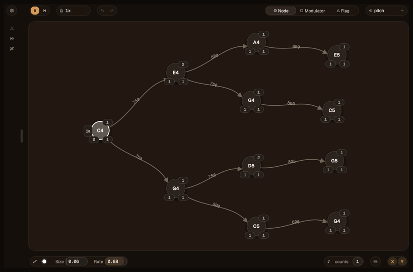

<div align="center">

# SequenceTree

**Draw a graph. Hear a sequence.**

A MIDI sequencer plugin where you compose music by drawing graphs of notes that gets traversed.




[Features](#features) · [What's under the hood](#whats-under-the-hood) · [AI integration](#ai-integration-and-workflow) · [Building](#building) · [Scripting guide](documentation/ScriptingLanguage.md)

</div>

---

## How it works

You place **nodes** on a canvas and connect them with **arrows**. Each node holds a note. When you press play, SequenceTree walks the graph and plays every node it lands on.

- **An arrow's length is the note's length.** Stretch an arrow and that note lasts longer. The layout of the graph *is* the rhythm.
- **Nodes count their visits.** Each node has a count limit. Once a node has been played that many times, the walk moves on to a different child. Simple counts like this build up into long patterns that evolve over time without repeating.
- **It plays into anything.** SequenceTree only sends MIDI, so it can drive any synth or sampler in your DAW, or run standalone.

## Features

| | |
|---|---|
| **Visual composition** | Shift-click to place a node and drag to connect it. Moving a node retimes the music as you drag. |
| **Chords** | Stack nodes vertically to play them together. |
| **Pitch-linked arrows** | Bind an arrow to pitch, so moving a node up or down also transposes it. |
| **Modulators** | A small graph attached to a node that walks alongside it, shifting its pitch and stretching its length differently on each visit. |
| **Many walkers at once** | Up to 128 walks run through the same graph at the same time, and flags on the canvas can start new ones. |
| **Groups** | Gather nodes into a group to handle them as one, and dissolve it again when you need to. |
| **Scripting** | Write a short script to change how the walk picks its next note. Your script is checked as you type and errors are marked on the line. See the [scripting guide](documentation/ScriptingLanguage.md). |
| **DAW sync** | Follows your DAW's play, stop, tempo and playhead. Jump anywhere in the song and the graph lands where it would have been. |

## What's under the hood

### Audio that never stutters

Audio software has a strict deadline. Every few milliseconds the computer asks the plugin for the next slice of sound. If the plugin is even slightly late, the listener hears a click or a dropout.

The usual cause of lateness is waiting: on memory being handed out, or on another part of the program to finish. **SequenceTree's audio code never waits.**

- **It never asks for memory while playing.** Everything it needs is set aside before playback starts.
- **The editor never blocks the music.** Editing builds a complete new copy of the graph off to the side, then swaps it in all at once. The music always reads either the old graph or the new one, never a half-edited mix. Old copies are cleaned up only once the audio is certainly finished with them.
- **The audio side never waits for the screen.** It drops messages for the display ("light up this node") into a mailbox the screen picks up once per frame. If the window is closed, the music carries on as normal.
- **This is tested, not just intended.** A dedicated test build uses a checker that crashes the program the instant the audio code reaches for memory, waits on another part of the program, or makes any other call that could be slow. That test plays a graph while it is edited, retimed, rewound and stopped.

### A programming language built in

The scripting feature is a small language written from scratch. The script is read, checked and translated into compact instructions for a tiny virtual machine, and that machine runs the script during playback. The translating happens off the audio path, so only the finished instructions ever reach it.

User code can't be allowed to freeze the music, so every script runs with a **fixed step allowance**. A script stuck in an endless loop is cut off and playback continues. A script with errors never goes live, and the last version that worked keeps playing.

### One set of rules for every walk

The main walk, modulators and nested graphs all move through a graph by **the same code path**. A rule written once behaves the same everywhere. The test suite checks this by building the same shape both ways and confirming they play the identical sequence.

### Tested

About 90 automated tests ([Catch2](https://github.com/catchorg/Catch2)) cover how the walk moves through a graph, the script language, and how a graph's shape becomes timing and pitch. The core that walks the graph is independent of the plugin framework, so its tests build in seconds.

## AI Integration and Workflow

I designed SequenceTree and wrote its core by hand: the graph model, the audio engine and its real-time safety, the scripting language and the interface. Every architectural decision in this README is mine.

As the project grew, I brought in AI coding agents as a tool, the way I'd use a refactoring IDE or a linter. They help with audits, large refactors and repetitive edits, always inside an architecture and set of rules I had already defined. To keep their output to my standards, I built the tooling that controls them.

**Agent work goes through four stages, each one a folder of plain markdown** (`.claude/context/`):

1. **Analysis.** One agent audits the code or researches a topic and writes a report.
2. **Review.** A second agent checks each claim in the report against the actual source, like an advisor grading a paper, and keeps only what holds up.
3. **Proposal.** What survives becomes a step-by-step plan, with open decisions left for me.
4. **Implementation.** Only a plan I have approved gets built.

**Automatic checks hold every edit to my design rules.** Before an agent can finish, scripts check its changes against the rules I wrote for this codebase and run the tests. A failed check sends it back to fix the problem.

**Tools I built for this workflow:**

- **[research-suite](https://github.com/EliBaumgardner/research-suite)**, a Claude Code plugin that runs the four-stage pipeline, the checks, and a set of C++ refactoring commands.
- **TreeJev**, which reads each request, decides what kind of work it is (a question, a code change, research) and which checks it owes. Its decision trees are in `treejev/`.
- **`.claude/CLAUDE.md`**, the project briefing I maintain so every agent works from the same understanding of the architecture.

## Building

**Requirements:** CMake 3.22+, a C++20 compiler (Xcode on macOS), and Git.

```bash
git clone https://github.com/EliBaumgardner/SequenceTree.git
cd SequenceTree
git submodule update --init --recursive   # fetches JUCE and Catch2

cmake -B build -DCMAKE_BUILD_TYPE=Release
cmake --build build --config Release
```

A successful build installs the AU, VST3 and Standalone app to your system plugin folders automatically.

**Running the tests:**

```bash
cmake --build build --target SequenceTree_Tests SequenceTree_GraphTests
cd build && ctest --output-on-failure
```

## License

SequenceTree's own source is MIT licensed. See [LICENSE](LICENSE).

It is built on [JUCE](https://juce.com), which is separately licensed under AGPLv3 or a JUCE commercial license. Using and distributing the built plugin is subject to those terms.
